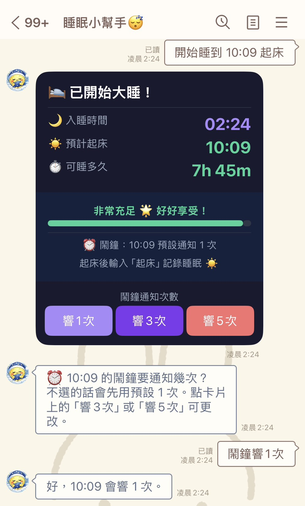

# Sleep Line Bot 睡眠小幫手

Sleep Line Bot 是一個 LINE Messaging API 睡眠管理機器人，提供睡眠紀錄、鬧鐘提醒、睡眠週期建議、今日統計與週報告。專案使用 Flask 開發，部署於 Google Cloud Run，並以 Firestore 儲存使用者睡眠紀錄與設定。




## 主要功能

- 開始睡眠計時：支援小睡、中睡、大睡
- 起床後依照實際睡眠時長自動重新分類
- 設定鬧鐘：支援指定時間、幾分鐘後提醒、通知次數設定
- 查看或取消目前鬧鐘
- 同一天可累積多筆睡眠與小睡紀錄
- 今日統計：加總當天所有睡眠紀錄
- 週報告：查看最近 7 天睡眠趨勢
- 算可睡多久：輸入想起床時間，計算目前還能睡多久
- 睡眠週期：以 90 分鐘週期推薦合適起床時間
- 睡眠建議：提供睡眠小知識與計算工具入口
- 電腦版 LINE 可直接輸入文字指令操作
- 使用者加好友時自動發送歡迎說明

## 使用指令

使用者可在手機版或電腦版 LINE 直接輸入：

```text
開始睡覺
起床
今日統計
週報告
鬧鐘
睡眠建議
算可睡多久
睡眠週期
說明
```

範例：

```text
我要睡20分鐘
鬧鐘 07:30 3次
現在睡 07:30 起床
睡眠週期
睡眠週期 10分鐘後睡著
```

## 技術架構

- Python
- Flask
- LINE Messaging API
- Google Cloud Run
- Google Firestore
- APScheduler

## 專案結構

```text
app.py              # Flask app、LINE webhook、鬧鐘排程
db.py               # Firestore 資料存取
flex_messages.py    # LINE Flex Message 樣板
setup_rich_menu.py  # LINE 圖文選單設定
rich_menu.jpg       # LINE 圖文選單圖片
assets/             # README 截圖與 GIF 展示
requirements.txt    # Python 套件
Dockerfile          # Cloud Run container build
```

## Firestore Collections

```text
sleep_records   # 睡眠紀錄
user_settings   # 鬧鐘、睡前提醒、互動狀態
```

## 環境變數

部署或本機執行前需設定：

```text
LINE_CHANNEL_ACCESS_TOKEN
LINE_CHANNEL_SECRET
```

部署在 Cloud Run 時，Firestore 會使用 Google Application Default Credentials。Cloud Run 的 service account 需要具備 Firestore 讀寫權限。

## 本機開發

```bash
python -m venv venv
source venv/bin/activate
pip install -r requirements.txt
python app.py
```

Webhook endpoint:

```text
/callback
```

## 部署到 Cloud Run

```bash
gcloud run deploy sleep-linebot \
  --source . \
  --region asia-east1 \
  --allow-unauthenticated
```

部署完成後，將 LINE Developers 的 Webhook URL 設為：

```text
https://YOUR_CLOUD_RUN_URL/callback
```

## GitHub About

Repo description：

```text
睡眠紀錄、鬧鐘提醒、睡眠週期建議與統計報告 LINE Bot / A LINE bot for sleep tracking, alarms, sleep cycle suggestions, and reports.
```

---

## English

Sleep Line Bot is a LINE Messaging API bot for sleep tracking, wake-up alarms, sleep cycle suggestions, daily statistics, and weekly sleep reports. It is built with Flask, deployed on Google Cloud Run, and stores user records in Firestore.

### Features

- Start sleep tracking by sleep type: nap, medium sleep, or long sleep
- Reclassify sleep type by actual duration when the user wakes up
- Set wake-up alarms by exact time or duration, with configurable notification count
- Cancel or update existing alarms
- Track multiple sleep sessions in the same day
- View daily sleep statistics and weekly reports
- Calculate how long the user can sleep until a target wake-up time
- Recommend wake-up times based on 90-minute sleep cycles
- Show sleep tips and a text-based command guide for desktop LINE users
- Send a short welcome message when a user adds the bot

### Commands

```text
開始睡覺
起床
今日統計
週報告
鬧鐘
睡眠建議
算可睡多久
睡眠週期
說明
```

## 📝 授權

個人專案，請依 [LICENSE](LICENSE) 授權使用。
